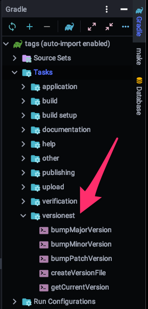

# versionest gradle plugin

Auto-magically handles version based on semantic versioning.
Version information is stored and read from "version.properties".
This plugin exposes tasks to bump the version and read it into `build.gradle`.



# Setup

1. Configure build.gradle with the following at a minimum:

```groovy
buildscript {

    repositories {

        maven {

            url 'https://nexus.matthewdavis.io/repository/gradle.plugins'

        }

    }

    dependencies {

        classpath group: 'gradle.plugins', name: 'versionest', version: '0.0.23'

    }

}

apply plugin: 'versionest'
version = versionest.version.toString()
```
2. Create a file called "version.properties" with the following line:

 ```properties
0.0.0
```

# Usage

```bash
Versionest tasks
----------------
bumpMajorVersion
bumpMinorVersion
bumpPatchVersion
createVersionFile
getCurrentVersion
```

```bash
 $ gradle bumpMajorVersion   (i.e.: 1.0.0 to 2.0.0)
 $ gradle bumpMinorVersion   (i.e.: 1.1.0 to 1.2.0)
 $ gradle bumpPatchVersion   (i.e.: 1.0.1 to 1.0.2)
```
